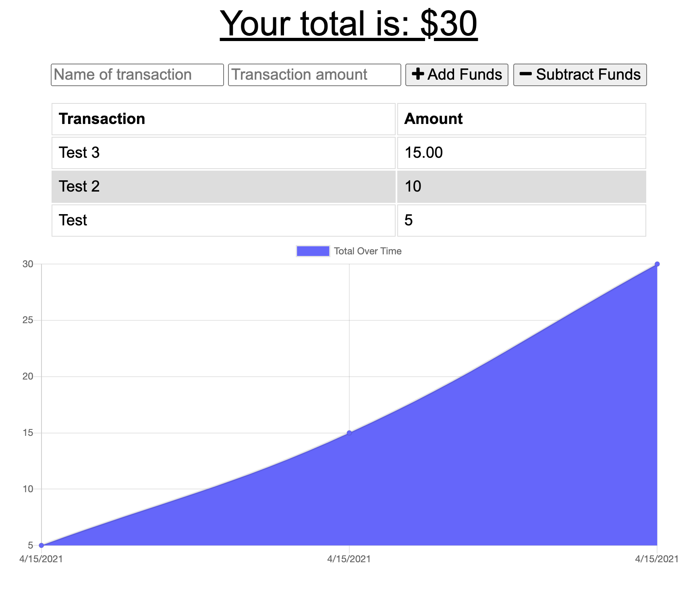

# Online/Offline Budget Tracker

## Description
This app was built to satisfy requirements for a UNC-Chapel Hill bootcamp homework assignment. It is a simple budget tracking app that works online and offline. 

## User Story
AS AN avid traveller
I WANT to be able to track my withdrawals and deposits with or without a data/internet connection
SO THAT my account balance is accurate when I am traveling

## Acceptance Criteria
GIVEN a user is on Budget App without an internet connection
WHEN the user inputs a withdrawal or deposit
THEN that will be shown on the page, and added to their transaction history when their connection is back online.

## Installation/Usage
Local development: 

`node server.js`

Deployed app: 

https://budget-tracker87.herokuapp.com/

